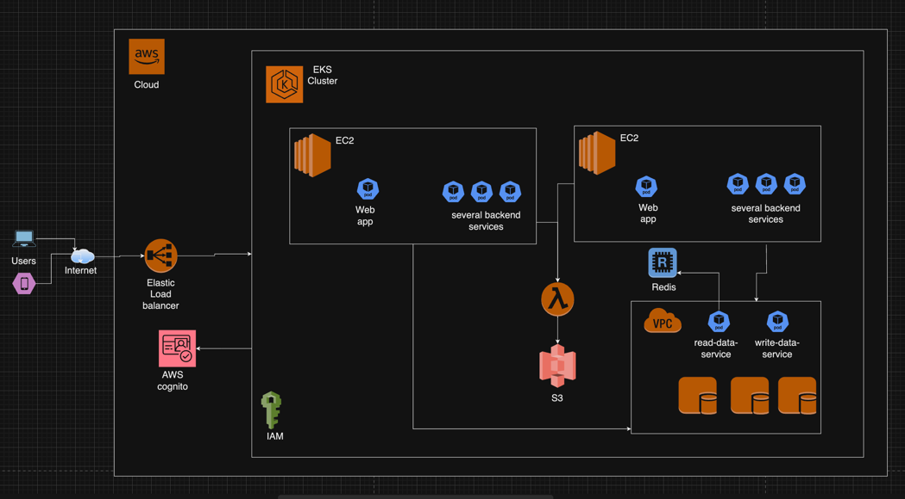

# lab-eleven Designing and simulating AWS cloud architecture

## Lab Overview:
This lab guides participants through the theoretical design of a secure and scalable web application architecture using AWS services. It will explore the integration of core AWS services, IAM configurations, and strategies for optimizing resource management and cost.

## Objectives:
By the end of this lab, participants will be able to:

* Outline an AWS cloud architecture using core services like EC2, S3, and VPC.
* Design IAM roles and policies that ensure security and compliance with the principle of least privilege.
* Propose resource management strategies to optimize performance and cost.

## Solution

### Part 1: Designing Cloud Infrastructure

Diagram

### Part 2: IAM Configuration

Approach: 
Implement Least privilege 

Group Roles

* Devops lead: 
  * Privilege for metrics, costs, create components, instances in all modules in AWS
  * Can assign/remove permissions to other profiles sucha as Devs, tech leads
* Devops
  * Privilege for metrics, devops, create components, instances in all modules in AWS
* Managers/ Tech Leads
  * Privilege to handle Lambdas, S3, Read EKS
* Developers
  * Privilege to handle Lambdas

### Part 3: Resource Management Strategy

* Provisioning autoscaling but with Limit on the different AWS services, setting alerts to notify increment in the costs/charge in components
  * Lambdas
  * EC2
  * Kubernetes pods
  * SQS, S3 storage

### Part 4: Theoretical Implementation

* Design architecture with Devops engineers
* Present the Budget with the team (Devops, tech leads, Economical supporters)
* Contract account AWS provider
* Setup 
  * Setup EC2 for EKS pods (kubernetes)
    * for Deploy applications in kubernetes cluster
  * Setup VPC with restricted access for
    * Databases MongoDB instances
    * Microservice instance to Read Only data
    * Microservice instance to Write Only data
  * Setup Elastic Load balancer
  * Setup AWS cognito for Microservice to provide authentication logic for users of application
  * Setup Redis instance to help to reduce the access to database in specific for microservice-read-only
  * Setup Lambda for async process or event driven tasks
  * Setup S3 service to save/get objects in processes
  * Setup AWS cognito to signup and login registers for users
  * Developers: 
    * Setup components for CI/CD life cycle of development (commit, jenkins, docker, deploy)
    * Setup environments DEV, QA, Staging, PROD 

Optimization costs: 
* setup limits in autoscaling services
* setup alerts to Devops engineers,  Tech leads, architects to notify increment in costs
* Setup rules to autoscaling in specific days like hotSale or promotions for app depending on its business sector
* Use Kinesis/ or aws services that provide metrics and costs to get knowledge about project's costs
* Setup automatic audits to detect IAM roles not used in certain periods of time, to remove them and get updated and aligned with security policies
